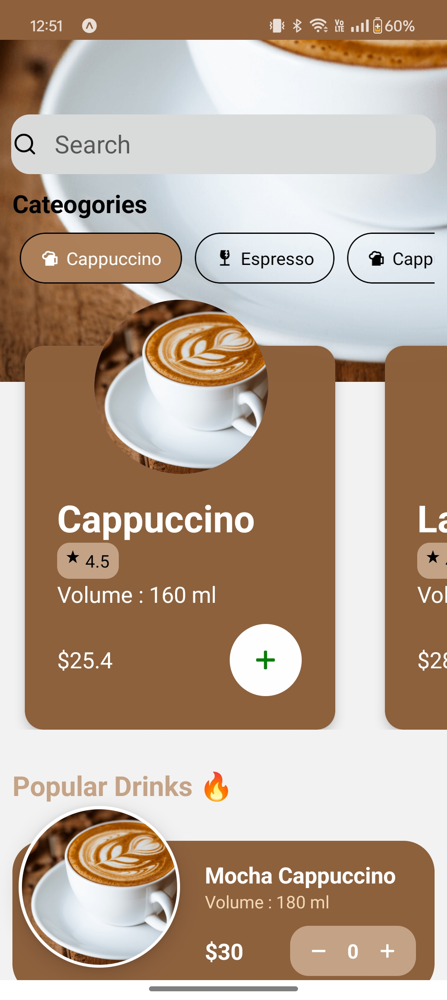
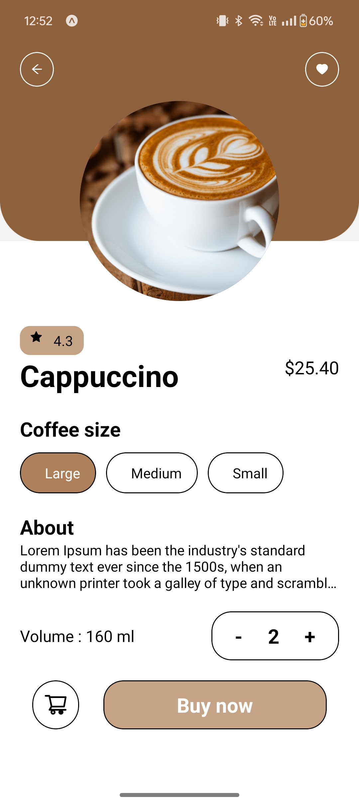
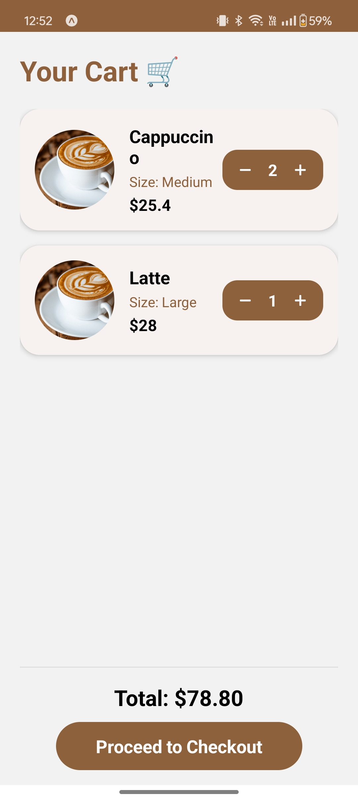

# CoffeeHouse App ☕✨
A beautifully designed React Native app for coffee lovers — browse, order, and enjoy your favorite drinks with a premium experience.

## Screenshots

## Features
- Browse coffee categories & popular drinks
- Animated, horizontal scrolling coffee cards
- Detailed coffee description with volume, ratings, and customization
- Add, remove, and adjust quantities in cart
- Checkout with total price calculation
- Premium UI with smooth animations
- Fully responsive & scrollable screens

## Tech Stack
- **Frontend:** React Native, Expo
- **Components & Libraries:** 
  - react-native-paper (Avatar, UI elements)
  - react-native-vector-icons (Icons)
  - FlatList & ScrollView for lists & scrolling
  - Custom reusable components: Background, CategoryCard, Header, SearchBar

## App Flow
Home Screen → Coffee Description → Cart → Checkout → Payment

## Installation

1. Clone the repo:
   git clone https://github.com/ErmMurtaza/CoffeeHouse.git

2. Install dependencies:
   cd CoffeeHouse
   npm install
   # or yarn install

3. Run the app:
   npx expo start

## Future Enhancements
- Payment integration (UPI, card, wallet)
- Order tracking with live updates
- User profile & past orders
- Push notifications for offers & discounts
